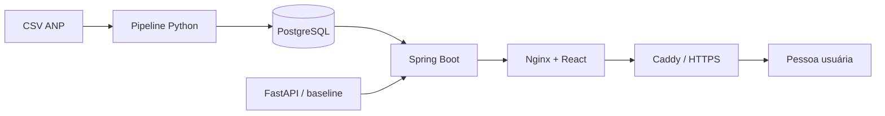

# FuelVision

[](https://github.com/Sidney-Emanuel-Oliveira/FuelVision/actions/workflows/quality.yml)

Plataforma full stack de Engenharia de Dados, Analytics e Machine Learning para
estudar preços de combustíveis com uma amostra pública controlada da ANP.


> [!IMPORTANT]
> Os 60 registros versionados não representam o mercado brasileiro. A previsão
> é um baseline experimental e um alerta estatístico não significa fraude.

## O que funciona

- ingestão raw imutável e identificada por hash;
- limpeza, padronização, validação e registros rejeitados;
- carga idempotente em seis tabelas PostgreSQL;
- consultas de média, mínimo, máximo, histórico e localidades;
- API Java/Spring Boot documentada com OpenAPI;
- dashboard React/TypeScript responsivo com filtros e tabelas acessíveis;
- estimativa experimental servida por FastAPI;
- detecção de comportamentos atípicos pelo intervalo interquartil;
- quatro imagens Docker, health checks e GitHub Actions;
- configuração de publicação em servidor único com HTTPS automático;
- perfil full stack para Vercel Services com PostgreSQL externo.

## Arquitetura



Veja a [arquitetura atual](docs/arquitetura/ARQUITETURA_ATUAL.md) para fluxos,
responsabilidades, limites de confiança e decisões.

## Tecnologias

| Área | Tecnologias |
| --- | --- |
| dados | Python 3.11, biblioteca padrão e CSV |
| banco | PostgreSQL 17 e SQL |
| Back-end | Java 21, Spring Boot, JDBC e OpenAPI |
| Front-end | React, TypeScript, Vite, Recharts e Nginx |
| Machine Learning | pandas, scikit-learn, joblib e FastAPI |
| qualidade | unittest, JUnit, Vitest, Ruff, Oxlint, Prettier e ShellCheck |
| execução | Docker, Docker Compose, Caddy e GitHub Actions |

## Início rápido

Pré-requisitos: Git, Docker e Docker Compose.

```bash
git clone https://github.com/Sidney-Emanuel-Oliveira/FuelVision.git
cd FuelVision
cp .env.example .env
```

Substitua as duas senhas de exemplo no `.env`. Depois:

```bash
docker compose config --quiet
docker compose up --detach --build --wait
docker compose ps
scripts/deploy_smoke.sh http://localhost:5173
```

Abra [http://localhost:5173](http://localhost:5173).

Para encerrar preservando o banco:

```bash
docker compose down
```

Consulte o [guia de instalação](docs/INSTALACAO.md) para configuração, logs,
execução direta e solução de erros.

## API

| Método | Caminho | Uso |
| --- | --- | --- |
| GET | `/api/prices` | observações paginadas |
| GET | `/api/prices/summary` | indicadores por produto |
| GET | `/api/prices/history` | histórico diário |
| GET | `/api/prices/anomalies` | alertas IQR |
| GET | `/api/locations/states` | estados disponíveis |
| GET | `/api/locations/cities` | municípios por estado |
| GET | `/api/predictions/model` | metadados do estimador |
| POST | `/api/predictions` | estimativa experimental |

Exemplo:

```bash
curl --fail http://localhost:5173/api/prices/summary
```

Contratos, filtros e respostas estão na [referência da API](docs/REFERENCIA_API.md).

## Dados e resultados verificáveis

A fonte identificada possui 422.418 registros no CSV completo. O Git contém
somente 60 registros selecionados deterministicamente para estudo.

No teste temporal do experimento:

| Abordagem | MAE | RMSE |
| --- | ---: | ---: |
| baseline por produto | 0,527108 | 0,810756 |
| Ridge | 0,571978 | 0,816480 |

O Ridge foi pior; por isso, o serviço usa o baseline simples e deixa essa
limitação visível. Consulte [dados, métricas e limitações](docs/DADOS_METRICAS_LIMITACOES.md)
e o [model card](docs/ml/MODEL_CARD.md).

## Testes e qualidade

Com as dependências locais instaladas:

```bash
scripts/quality.sh
scripts/quality.sh --with-postgres
```

A barreira completa reúne lint, formatação, testes Python/Java/Front-end e
builds Maven/Vite. O GitHub Actions também constrói as imagens, inicia os
serviços e executa smoke tests a cada push no `main` e pull request.

## Publicação

O projeto possui duas estratégias de publicação.

Para uma demonstração full stack na Vercel, use o perfil que reúne React,
Spring Boot e FastAPI no mesmo domínio e mantém o PostgreSQL em um provedor
gerenciado:

```bash
scripts/prepare_vercel_database.sh
```

Leia o [guia de publicação na Vercel](docs/DEPLOY_VERCEL.md) antes de criar
recursos externos. A publicação ainda exige conta, banco, credenciais e revisão
dos possíveis custos.

Para um servidor Linux único:

```bash
docker compose \
  --env-file deploy/.env \
  -f compose.yaml \
  -f compose.production.yaml \
  up --detach --build --wait
```

Ela exige domínio e senhas fora do Git, acrescenta Caddy, HTTPS, cabeçalhos de
segurança e políticas de reinício. Nenhum servidor externo é criado
automaticamente. Leia o [guia de publicação](docs/DEPLOY.md) antes de expor o
sistema.

## Documentação

- [instalação](docs/INSTALACAO.md);
- [publicação na Vercel](docs/DEPLOY_VERCEL.md);
- [arquitetura atual](docs/arquitetura/ARQUITETURA_ATUAL.md);
- [referência da API](docs/REFERENCIA_API.md);
- [dados, métricas e limitações](docs/DADOS_METRICAS_LIMITACOES.md);
- [model card](docs/ml/MODEL_CARD.md);
- [segurança](docs/SEGURANCA.md) e [política de relatos](SECURITY.md);
- [acessibilidade](docs/ACESSIBILIDADE.md);
- [Docker e integração contínua](docs/quality/DOCKER_E_INTEGRACAO_CONTINUA.md);
- [demonstração e portfólio](docs/DEMONSTRACAO_PORTFOLIO.md);
- [plano oficial](docs/PLANO_FUELVISION.md) e [status](docs/STATUS_DO_PROJETO.md).

## Limitações

- amostra pequena, não aleatória e não representativa;
- atualização de dados não automática;
- estimativa constante por produto e sem intervalo de incerteza;
- alertas IQR com grupos de apenas dez observações;
- ausência de autenticação, rate limit, SLA e monitoramento;
- publicação em instância única, sem alta disponibilidade ou backup automático;
- perfil Vercel dependente de Services em beta e PostgreSQL externo;
- revisão de acessibilidade sem teste formal com tecnologia assistiva;
- licença do código-fonte ainda não selecionada pelo proprietário.

## Uso responsável

O FuelVision é uma demonstração educacional e técnica. Não é fonte oficial,
recomendação financeira, mecanismo de fiscalização nem garantia de preços.
Consulte a ANP para os dados oficiais e preserve os avisos ao reutilizar
resultados ou capturas.

## Autor

[Sidney Emanuel Oliveira](https://github.com/Sidney-Emanuel-Oliveira)
