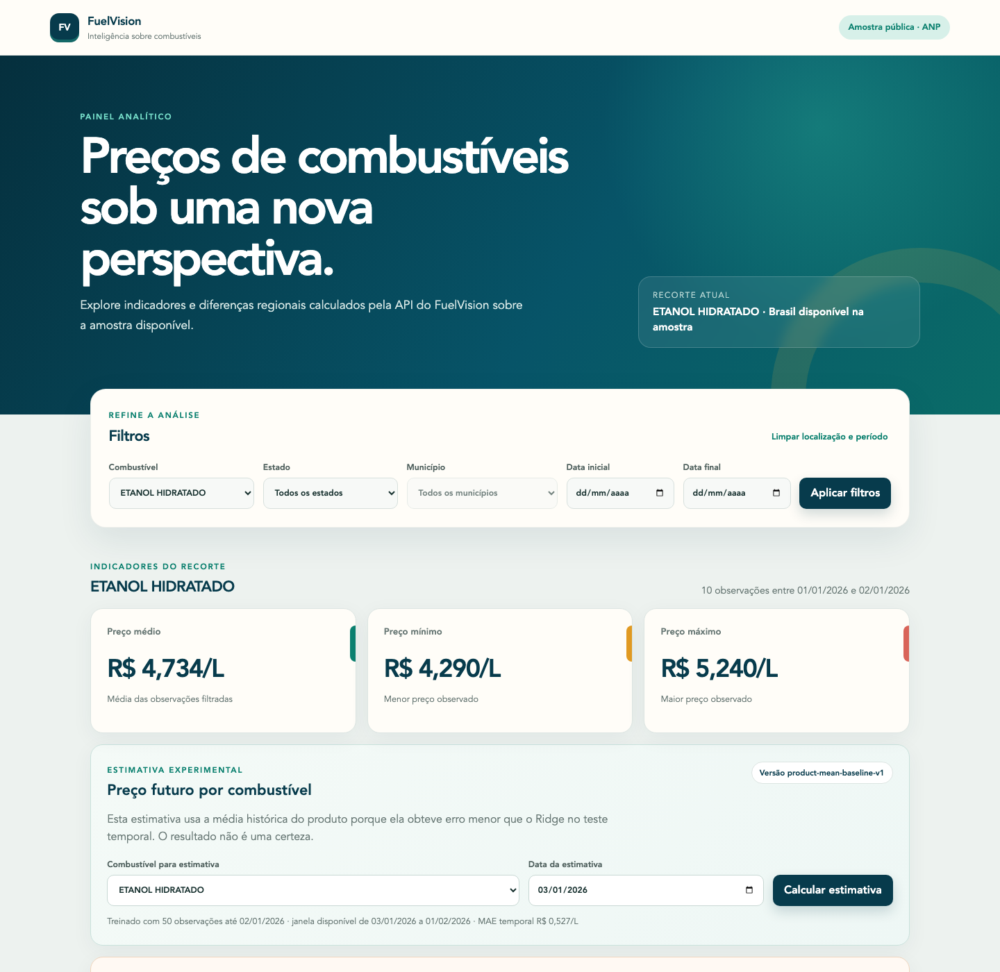

# Demonstração e apresentação no portfólio

## Objetivo

Este roteiro ajuda a apresentar o FuelVision de forma curta, verificável e sem
exagerar as capacidades dos dados ou do modelo.



## Preparar a demonstração

```bash
docker compose up --detach --build --wait
scripts/deploy_smoke.sh http://localhost:5173
```

Antes de gravar ou apresentar:

- confirme os quatro serviços como `healthy`;
- feche terminais que exibam variáveis ou caminhos pessoais;
- não mostre `.env`;
- use resolução legível;
- informe que os dados pertencem a uma amostra controlada.

## Roteiro de três minutos

### Problema

Dados públicos em CSV precisam ser preservados, validados e organizados antes
de alimentar indicadores ou estimativas confiáveis.

### Fluxo técnico

Mostre o diagrama e explique:

```text
ANP → raw → validação → PostgreSQL → Spring Boot → React
                                      ↘ FastAPI
```

### Funcionalidades

1. altere combustível e estado;
2. mostre média, mínimo, máximo e período;
3. abra a tabela equivalente a um gráfico;
4. solicite uma estimativa e leia o aviso;
5. mostre um alerta IQR e explique que não representa fraude.

### Qualidade

Apresente Docker Compose, testes automatizados e a execução verde do GitHub
Actions. Explique que lint, testes, build, health check e smoke test verificam
aspectos diferentes.

### Limitação

Finalize informando que a amostra possui 60 observações, o Ridge não superou o
baseline e a configuração de publicação é para demonstração em um servidor
único.

## Descrição curta para currículo

> FuelVision — plataforma full stack para análise de preços de combustíveis
> sobre amostra pública da ANP, com pipeline Python, PostgreSQL, API Spring
> Boot, dashboard React/TypeScript, baseline de ML, detecção IQR, Docker e CI.

## Pontos técnicos para entrevista

- idempotência e rastreabilidade entre raw e processado;
- chave de negócio e restrições no PostgreSQL;
- separação controller, service e repository;
- contratos entre Java, Python e TypeScript;
- separação temporal e comparação com baseline;
- motivo para não chamar anomalia de fraude;
- health checks e dependências no Compose;
- segredos fora do Git e publicação com HTTPS.

## Afirmações que devem ser evitadas

- “processa Big Data” — o projeto demonstra arquitetura sobre uma amostra;
- “prevê o preço brasileiro” — o estimador é um baseline experimental;
- “detecta fraude” — o IQR apenas sinaliza comportamento atípico;
- “está pronto para qualquer escala” — não houve teste de carga ou alta
  disponibilidade;
- “cumpre WCAG” — houve revisão parcial, não certificação.

## Checklist antes de compartilhar

- README e imagem carregam no GitHub;
- workflow da branch principal está verde;
- repositório não contém `.env`, artefato ou dado grande;
- links da documentação funcionam;
- instruções de instalação foram reproduzidas;
- model card e limitações estão visíveis;
- licença de código foi decidida ou a ausência está declarada;
- nenhum endereço público é anunciado antes de existir.
