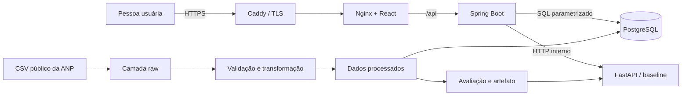

# Arquitetura atual do FuelVision

## Propósito

Este documento representa o sistema que existe ao final do Módulo 12. Ele não
é uma promessa de componentes futuros.

**Arquitetura de software** é a organização dos componentes, das
responsabilidades e das comunicações de um sistema. No FuelVision, ela separa
preparação de dados, persistência, API, estimativa e apresentação para que cada
parte possa ser compreendida e testada isoladamente.

## Visão geral



No desenvolvimento local, o navegador acessa diretamente o Nginx pela porta
`5173`. Na publicação em um servidor, o Caddy é a única entrada pública e
encaminha o tráfego para o Nginx pela rede interna do Compose.

## Componentes executáveis

| Componente | Tecnologia | Responsabilidade | Porta interna |
| --- | --- | --- | ---: |
| `postgres` | PostgreSQL 17 | persistir 60 observações da amostra e views | 5432 |
| `prediction` | Python, FastAPI e scikit-learn | carregar o artefato e calcular estimativas | 8000 |
| `backend` | Java 21 e Spring Boot | validar filtros e expor a API pública | 8080 |
| `frontend` | React, TypeScript e Nginx sem privilégios | apresentar o dashboard e encaminhar `/api` | 8080 |
| `gateway` | Caddy | terminar HTTPS e aplicar cabeçalhos de segurança | 80/443 |

O `gateway` existe somente quando `compose.production.yaml` é combinado com o
Compose base.

## Fluxo de uma consulta

```text
navegador
→ Caddy recebe HTTPS
→ Nginx entrega arquivos do React ou encaminha /api
→ Spring valida os parâmetros
→ repository executa SQL parametrizado
→ PostgreSQL devolve os registros
→ Spring serializa JSON
→ React apresenta o resultado
```

Uma previsão acrescenta a chamada interna `Spring → FastAPI`. O navegador não
conhece o endereço do serviço Python.

## Fluxo dos dados

```text
CSV de entrada
→ verificação de extensão, cabeçalho e integridade
→ cópia imutável na camada raw
→ padronização e validações de domínio
→ registros processados + registros rejeitados
→ carga idempotente no PostgreSQL
→ views analíticas
```

**Idempotência** significa que repetir uma operação com a mesma entrada não
deve criar duplicidades nem alterar silenciosamente um resultado existente. A
ingestão, a transformação e a carga aplicam esse princípio em níveis diferentes.

## Limites de confiança

Um **limite de confiança** é uma fronteira em que dados ou requisições passam
de um componente para outro e precisam ser validados.

- arquivos externos são verificados antes de entrar na camada raw;
- parâmetros HTTP são validados pelo Spring;
- consultas usam parâmetros em vez de concatenar entrada no SQL;
- o Back-end valida produto e data antes de solicitar uma estimativa;
- somente Caddy publica portas para a internet na configuração de servidor;
- segredos ficam em `deploy/.env`, fora do Git.

## Disponibilidade e falhas

Os health checks verificam banco, serviço de estimativa, Back-end e Front-end.
O Compose só inicia dependentes quando suas dependências estão saudáveis. Isso
melhora a inicialização, mas não substitui monitoramento, redundância ou teste de
carga.

Se o serviço de estimativa falhar, o Back-end devolve `503` para esse recurso;
as consultas históricas continuam sendo uma responsabilidade independente.

## Decisões principais

- um contêiner por processo mantém responsabilidades e logs separados;
- PostgreSQL é a fonte de verdade das consultas analíticas;
- Spring Boot é o contrato público, inclusive para estimativas;
- o Front-end usa a mesma origem de `/api`, evitando CORS amplo;
- o Caddy foi escolhido para HTTPS automático em um único servidor;
- Compose foi mantido porque a escala atual não justifica Kubernetes.

## Limitações arquiteturais

- existe uma única instância de cada serviço;
- o banco do Compose não possui backup automático;
- não existe balanceamento, fila, cache distribuído ou observabilidade;
- a publicação preparada pressupõe um único servidor Linux;
- a amostra e o artefato são educacionais e não representam o Brasil;
- não existe migração automatizada de esquema nem atualização automática do modelo.

## Referências oficiais

- [Docker: uso do Compose em produção](https://docs.docker.com/compose/how-tos/production/)
- [Caddy: proxy reverso](https://caddyserver.com/docs/caddyfile/directives/reverse_proxy)
- [Caddy: início rápido com HTTPS](https://caddyserver.com/docs/quick-starts/https)
